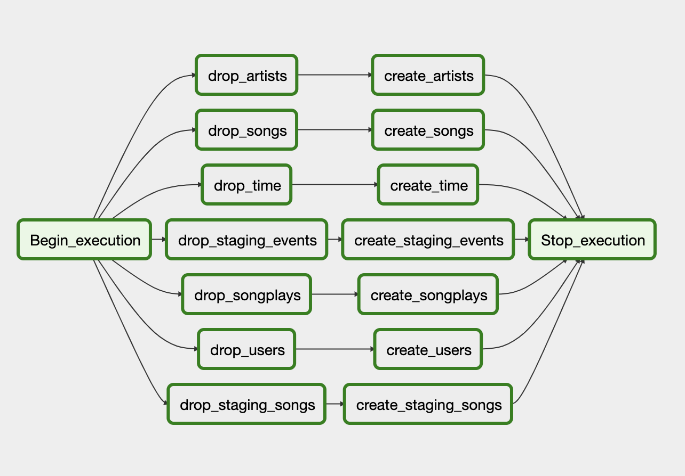
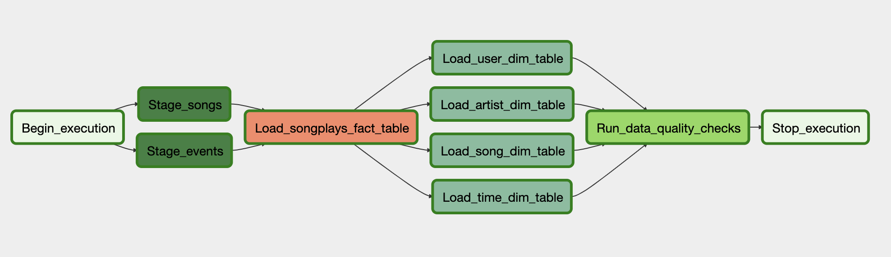

# data-pipeline
A sample project showing how to construct a Data Pipeline using Python, AWS (S3 and Redshift) and Airflow. 

## DAGs
The project consists of two DAGs, one for initializing an empty Database and one for populating the data:
* db_initialization_dag.py

* data_load_dag.py

The Data Pipeline makes use of four Custom Operators:
* StageToRedshiftOperator
* LoadDimensionOperator
* LoadFactOperator
* DataQualityOperator

